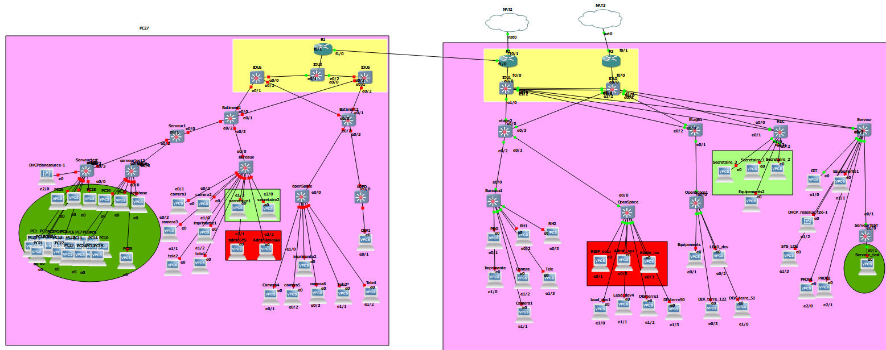

# TP8 INFRA : Make ur own

## I. Expression du besoin

deja merde voila ca c'est dit  


on est dans un reseaux de moyenne capacité environ 200 employé donc une architecture de type 3-tier semble adapté pour de la redondance 

on a different type de reseaux 

10serveur en prod 10 en test

lune  
on part sur un petit infra avec un routeur 2 switche redondant qui relie la salle serveur au deux batiment
on definie des Vlan differente part categorie

| NONE               | Vlan | Desciption                                       |
| ------------------ | ---- | ------------------------------------------------ |
| EmployeBetise      | 70   | les dev ils font des betise donc DANGER          |
| EmployeMoinsBEtise | 65   | secretaire PDG etc ils font de betise donc ca va |
| Admin              | 11   | Acces au serveurs sans pb                        |
| Serveur            | 5/10 | config a part voir plus bas                      |
| Equipements Tele   | 40   | télé                                             |
| Equipements camera | 45   | camera                                           |
| Equipements impri  | 50   | imprimante                                       |
| IPTEl              | 60   | ip tel                                           |
|                    |      |                                                  |

Salle serveur Lune

| None               | Batiment2 |     |
| ------------------ | --------- | --- |
| DHCP               | vlan  10  |     |
| Plateforme de test | Vlan   5  |     |
| Nat                |           |     |
| Autre SIte         |           |     |

Les acces-list  
-      les admins doivent pour voir avoir acces partout pour leur maintenance
-      les dev doivent pouvoir join les serveur de test mais pas de prod meme les lead et aussi acces au git
-      les MoinsBetes ils ont internet est c'est deja pas mal 


Liste des Client du bat1 

-   1admin sys et   1admin reseaux dans un bureaux
-   2 secretaire dans un bureaux
-   1 imprimante
-   2 camera dans le bat et  1 a l'entré
-   2 télé
-   4 ip tel
-   serveur

Liste des Client du bat2
-   2 leaddev /12 dev   
-   3 cam 1 entré 2 dedans
-   1 imprimante
-   2 télé  

LUNE CLient 
| NOM             | Vlan | Batiment1 | Batiment2 | IP     |
| --------------- | ---- | --------- | --------- | ------ |
| `secretaire1`   | 65   | ✅        | ❌        | DHCP   |
| `secretaire1`   | 65   | ✅        | ❌        | DHCP   |
| `Admin SYS`     | 11   | ✅        | ❌        | DHCP   |
| `Admin reseaux` | 11   | ✅        | ❌        | DHCP   |
| `camera1`       | 45   | ✅        | ❌        | Static |
| `camera2`       | 45   | ✅        | ❌        | Static |
| `camera3`       | 45   | ✅        | ❌        | Static |
| `Tele1`         | 40   | ✅        | ❌        | Static |
| `Tele2`         | 40   | ✅        | ❌        | Static |
| `imprimante1`   | 50   | ✅        | ❌        | Static |
| `reseaux TEL`   | 60   | ✅        | ✅        | DHCP   |
| `imprimante2`   | 50   | ❌        | ✅        | Static |
| `camera 4`      | 45   | ❌        | ✅        | Static |
| `camera 5`      | 45   | ❌        | ✅        | Static |
| `camera 6`      | 45   | ❌        | ✅        | Static |
| `Tele 3`        | 40   | ❌        | ✅        | Static |
| `Tele 4`        | 40   | ❌        | ✅        | Static |
| `DEV`           | 70   | ❌        | ✅        | DHCP   |
|                 |      |           |           |        |

LUNE infra  

| NOM           | `10.7.65.248/28`   | `10.7.11.240/28`   | `10.7.45.0/24`   | `10.7.40.240/28`   | `10.7.50.248/29`   | `10.7.60.0/24`   | `10.7.70.0/24`   | `10.7.5.248/29`   | `10.7.10.192/26`     |
| ------------- | ---------------- | ---------------- | ---------------- | ---------------- | ---------------- | ---------------- | ---------------- | --------------- | ------------------ |
| `R1`          | `10.7.65.254/28` | `10.7.11.254/28` | `10.7.45.254/24` | `10.7.40.254/28` | `10.7.50.254/29` | `10.7.60.254/24` | `10.7.70.254/24` | `10.7.5.254/29` | `10.7.10.254/26`   |
| `DHCP`        | ❌               | ❌               | ❌               | ❌               | ❌               | ❌               | ❌               | `10.7.5.253/29` | ❌                 |
| `TEST`        | ❌               | ❌               | ❌               | ❌               | ❌               | ❌               | ❌               | ❌              | `10.7.10.193-223/26` |
| `Camera1`     | ❌               | ❌               | `10.7.45.1/24`   | ❌               | ❌               | ❌               | ❌               | ❌              | ❌                 |
| `Camera2`     | ❌               | ❌               | `10.7.45.2/24`   | ❌               | ❌               | ❌               | ❌               | ❌              | ❌                 |
| `Camera3`     | ❌               | ❌               | `10.7.45.3/24`   | ❌               | ❌               | ❌               | ❌               | ❌              | ❌                 |
| `Camera4`     | ❌               | ❌               | `10.7.45.4/24`   | ❌               | ❌               | ❌               | ❌               | ❌              | ❌                 |
| `Camera5`     | ❌               | ❌               | `10.7.45.5/24`   | ❌               | ❌               | ❌               | ❌               | ❌              | ❌                 |
| `Camera6`     | ❌               | ❌               | `10.7.45.6/24`   | ❌               | ❌               | ❌               | ❌               | ❌              | ❌                 |
| `Tele1`       | ❌               | ❌               | ❌               | `10.7.40.1241/28`   | ❌               | ❌               | ❌               | ❌              | ❌                 |
| `Tele2`       | ❌               | ❌               | ❌               | `10.7.40.242/28`   | ❌               | ❌               | ❌               | ❌              | ❌                 |
| `Tele3`       | ❌               | ❌               | ❌               | `10.7.40.243/28`   | ❌               | ❌               | ❌               | ❌              | ❌                 |
| `Tele4`       | ❌               | ❌               | ❌               | `10.7.40.244/28`   | ❌               | ❌               | ❌               | ❌              | ❌                 |
| `Imprimante1` | ❌               | ❌               | ❌               | ❌               | `10.7.50.249/29`   | ❌               | ❌               | ❌              | ❌                 |
| `Imprimante2` | ❌               | ❌               | ❌               | ❌               | `10.7.50.250/29`   | ❌               | ❌               | ❌              | ❌                 |
|               |                  |                  |                  |                  |                  |                  |                  |                 |                    |


TERRE  
infra de type tier 3

meme vlan que sur la lune

| NONE               | Vlan | Desciption                                       |
| ------------------ | ---- | ------------------------------------------------ |
| EmployeBetise      | 70   | les dev ils font des betise donc DANGER          |
| EmployeMoinsBEtise | 65   | secretaire PDG etc ils font de betise donc ca va |
| Admin              | 11   | Acces au serveurs sans pb                        |
| Serveur            | 5/10 | config a part voir plus bas                      |
| Equipements Tele   | 40   | télé                                             |
| Equipements camera | 45   | camera                                           |
| Equipements impri  | 50   | imprimante                                       |
| IPTEl              | 60   | ip tel                                           |
|                    |      |                                                  |


la batiment est composé 

SOUS SOL
-   DHCP
-   2 serveur de prod
-   30 de test
-   database
-   DNS
-   GIT
-   1 imprimante
-   2 camera
-   1 tele

REz de chaussé
-   3 secretaire
-   1 imprimante
-   3 camera
-   2 tele

1 etage

-   72 dev
-   3 lead dev
-   2 secretaire bureux dedié
-   1 imprimante
-   2 camera
-   1 tele


2 etage

-   1 resp secu
-   1 admin sys
-   1 admin reseaux
-   1 pdg dans son bureaux
-   2 rh dans un bureaux
-   4 lead dev
-   50 dev
-   1 imprimante
-   2 camera
-   1 tele

TERRE

| NOM            | `10.8.65.96/28`     | `10.8.11.0/28`    | `10.8.45.240/28`     | `10.8.40.240/28`     | `10.8.50.240/28`     | `10.8.60.0/24`   | `10.8.70.0/24`     | `10.8.5.240/28`     | `10.8.10.192/26`    |
| -------------- | ------------------- | ----------------- | -------------------- | -------------------- | -------------------- | ---------------- | ------------------ | ------------------- | ------------------- |
| `R2`           | `10.8.65.108/28`    | `10.8.11.12/28`   | `10.8.45.252/28`     | `10.8.40.252/28`     | `10.8.50.252/28`     | `10.8.60.252/24` | `10.8.70.252/24`   | `10.8.5.252/28`     | `10.8.10.252/26`    |
| `R3`           | `10.8.65.109/28`    | `10.8.11.13/28`   | `10.8.45.253/28`     | `10.8.40.253/28`     | `10.8.50.253/28`     | `10.8.60.253/24` | `10.8.70.253/24`   | `10.8.5.253/28`     | `10.8.10.253/26`    |
| `DHCP`         | ❌                  | ❌                | ❌                   | ❌                   | ❌                   | ❌               | ❌                 | `10.8.5.251/28`     | ❌                  |
| `DNS`          | ❌                  | ❌                | ❌                   | ❌                   | ❌                   | ❌               | ❌                 | `10.8.5.250/28`     | ❌                  |
| `DEV`          | ❌                  | ❌                | ❌                   | ❌                   | ❌                   | ❌               | `10.8.70.1-250/24` | ❌                  | ❌                  |
| `Admin`        | ❌                  | `10.8.11.5-10/28` | ❌                   | ❌                   | ❌                   | ❌               | ❌                 | ❌                  | ❌                  |
| `Direction`    | `10.8.65.97-106/28` | ❌                | ❌                   | ❌                   | ❌                   | ❌               | ❌                 | ❌                  | ❌                  |
| `Camera`       | ❌                  | ❌                | `10.8.45.240-250/28` | ❌                   | ❌                   | ❌               | ❌                 | ❌                  | ❌                  |
| `Tele`         | ❌                  | ❌                | ❌                   | `10.8.40.240-250/28` | ❌                   | ❌               | ❌                 | ❌                  | ❌                  |
| `imprimante`   | ❌                  | ❌                | ❌                   | ❌                   | `10.8.50.240-250/28` | ❌               | ❌                 | ❌                  | ❌                  |
| `Telephone`    | ❌                  | ❌                | ❌                   | ❌                   | ❌                   | `10.8.60.254/24` | ❌                 | ❌                  | ❌                  |
| `Serveur git`  | ❌                  | ❌                | ❌                   | ❌                   | ❌                   | ❌               | ❌                 | `10.8.5.249/28`     | ❌                  |
| `Serveur Prod` | ❌                  | ❌                | ❌                   | ❌                   | ❌                   | ❌               | ❌                 | `10.8.5.240-245/28` | ❌                  |
| `Serveur Test` | ❌                  | ❌                | ❌                   | ❌                   | ❌                   | ❌               | ❌                 | ❌                  | `10.8.10.193-223/26` |
| `serveur log`  | ❌                  | ❌                | ❌                   | ❌                   | ❌                   | ❌               | ❌                 | `10.8.5.248`        | ❌                  |
|                |                     |                   |                      |                      |                      |                  |                    |                     |                     |


TAbles des acces-list


| NONE     | Serveur TEST | Serveur PROD | camera | imprimante | tele | DEV | Admin | Direction | AutreServeur |
| -------- | ------------ | ------------ | ------ | ---------- | ---- | --- | ----- | --------- | ------------ |
| TEST     | ❌           | ❌           | ❌     | ❌         | ❌   | ✅  | ✅    | ❌        | ❌           |
| Prod     | ❌           | ❌           | ❌     | ❌         | ❌   | ❌  | ✅    | ❌        | ❌           |
| Cam      | ❌           | ❌           | ❌     | ❌         | ❌   | ❌  | ✅    | ❌        | ❌           |
| IMP      | ❌           | ❌           | ❌     | ❌         | ❌   | ✅  | ✅    | ✅        | ❌           |
| TELE     | ❌           | ❌           | ❌     | ❌         | ❌   | ✅  | ✅    | ✅        | ❌           |
| DEV      | ❌           | ❌           | ❌     | ❌         | ❌   | ❌  | ✅    | ❌        | ❌           |
| ADmin    | ❌           | ❌           | ❌     | ❌         | ❌   | ❌  | ✅    | ❌        | ❌           |
| DIR      | ❌           | ❌           | ❌     | ❌         | ❌   | ❌  | ✅    | ❌        | ❌           |
| ASERV    | ❌           | ❌           | ✅     | ❌         | ❌   | ✅  | ✅    | ❌        | ❌           |
| internet | ✅           | ✅           | ❌     | ❌         | ❌   | ✅  | ✅    | ✅        | ✅           |


les acces list ne sont configuré que sur le reseaux de la terre


Connexion entre terre et lune 

| none | `10.10.1.252/31` |     |     |
| ---- | ---------------- | --- | --- |
| R1   | `10.10.1.253/31` |     |     |
| R2   | `10.10.1.254/31` |     |     |
| R3   |                  |     |     |
|      |                  |     |     |


Pour conclure  
-   l'infra a ete faite en quasi totalité sur la lune si on exclut les acces-list et les nat mais le dhcp donne des dns et route par default (le nat pas fait car mes routeur etait en train de deceder)
-   sur la terre l'infra a été realisé a plus petite echelle mais les acces list et le bpdu guard sont focntionelle 
-   la communication entre terre et lune est assurée par le R1 et R2 via le protocole OSPF.

  

# [Config lune](./configTP8_Lune.md)  

# [config terre](./configTP8_Terre.md)

config DNS Lune  
```powershell
default-lease-time 600;
max-lease-time 7200;

authoritative;

subnet 10.7.65.0 netmask 255.255.255.0 {
    range dynamic-bootp 10.7.65.10 10.7.65.250;
    option domain-name-servers 10.8.5.250;
    option routers 10.7.65.254;
}

subnet 10.7.70.0 netmask 255.255.255.0 {
    range dynamic-bootp 10.7.70.1 10.7.70.252;
    option domain-name-servers 10.8.5.250;
    option routers 10.7.70.254;
}
subnet 10.7.11.0 netmask 255.255.255.0 {
    range dynamic-bootp 10.7.11.10 10.7.11.100;
    option domain-name-servers 10.8.5.250;
    option routers 10.7.11.254;
}
subnet 10.7.5.0 netmask 255.255.255.0 {
    range dynamic-bootp 10.7.5.250 10.7.70.252;
    option domain-name-servers 10.8.5.250;
    option routers 10.7.5.254;
}
```

config DNS Terre  
```powershell
subnet 10.8.65.96 netmask 255.255.255.240 {
    range dynamic-bootp 10.8.65.97 10.8.65.107;
    option domain-name-servers 10.8.5.250;
    option routers 10.8.65.110;
}

subnet 10.8.70. netmask 255.255.255.0 {
    range dynamic-bootp 10.8.70.1 10.7.70.250;
    option domain-name-servers 10.8.5.250;
    option routers 10.8.70.254;
}
subnet 10.8.11.0 netmask 255.255.255.240 {
    range dynamic-bootp 10.8.11.1 10.8.11.10;
    option domain-name-servers 10.8.5.250;
    option routers 10.8.11.14;
}
subnet 10.8.5.240 netmask 255.255.255.240 {
    range dynamic-bootp 10.8.5.240 10.8.5.250;
    option domain-name-servers 10.8.5.250;
    option routers 10.8.5.254;
}
```

Config du DNS
```powershell
[root@DNS ~]sudo dnf install bind bind-utils
[root@DNS ~]sudo nano /etc/named.conf
options {
    listen-on port 53 { any; };
    directory "/var/named";
    dump-file "/var/named/data/cache_dump.db";
    statistics-file "/var/named/data/named_stats.txt";
    memstatistics-file "/var/named/data/named_mem_stats.txt";
    allow-query { any; };
    recursion yes;
};

zone "dev.meow" IN {
    type master;
    file "/etc/named/zones/dev.meow.zone";
};
[root@DNS ~]sudo nano /etc/named/zones/dev.meow.zone

$TTL 1D
@   IN SOA  dns.dev.meow. admin.dev.meow. (
                2023010101 ; Serial
                3600       ; Refresh
                1800       ; Retry
                604800     ; Expire
                86400 )    ; Minimum TTL

@     IN NS   dns.dev.meow.
@     IN A    10.8.5.250

GIT    IN A    10.8.5.249
Admin_sys    IN A    10.8.11.5
Admin_secu  IN A    10.8.11.6
[...]
Seveur_test_Lune_1   IN A    10.7.10.193
Seveur_test_Lune_2   IN A    10.7.10.194
Seveur_test_Lune_3   IN A    10.7.10.195
[root@DNS ~]sudo nano /etc/resolv.conf
nameserver 10.8.5.250

```

# PS j'ai adoré le TP malgré la prise de tete